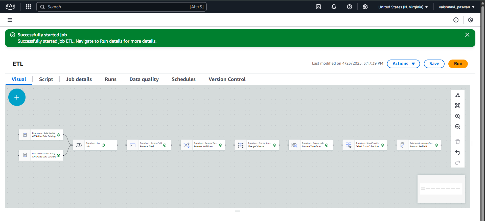
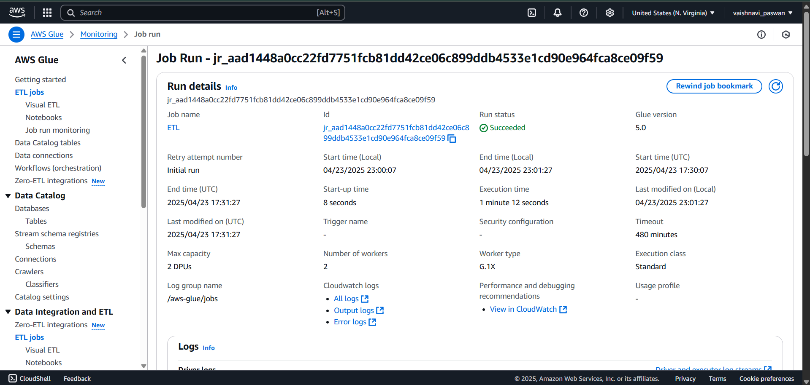

# PandemicInsights-ETL

A data pipeline project that performs ETL (Extract, Transform, Load) on COVID-19 datasets using **AWS Glue Studio** and loads the cleaned, merged data into **Amazon Redshift**.

## 🔄 Workflow Overview

- **Source**: Two CSV datasets containing COVID-19 statistics
- **ETL Tool**: AWS Glue (Visual Editor)
- **Transformation Steps**:
  - Read datasets from S3
  - Join datasets
  - Rename and clean columns
  - Remove nulls and merge fields using PySpark
  - Load into Redshift table

## 📁 Project Structure

```
PandemicInsights-ETL/
├── datasets/
├── scripts/
├── images/
├── outputs/
├── README.md
└── .gitignore
```

## 🧠 Custom Transformation

Located in [`scripts/custom_transform_covid19.py`](scripts/custom_transform_covid19.py), this script:
- Renames overlapping columns
- Uses `coalesce()` to merge semantically similar fields
- Drops redundant data

## 🖼️ Visual Workflow

### AWS Glue ETL Flow  


### Successful Job Execution  


## 📤 Output Sample

The final transformed dataset loaded into Redshift is available here:

🔗 [`outputs/final_redshift_output_sample.csv`](outputs/final_redshift_output_sample.csv)

This output reflects:
- Cleaned and standardized COVID-19 fields
- Merged columns using `coalesce()`
- Ready for downstream analytics and dashboards

## ⚙️ Technologies Used

- AWS Glue Studio (Visual ETL)
- Amazon Redshift
- AWS S3

---

## 👩‍💻 Author

**Vaishnavi Paswan**

---

## 🚀 Outcome

The pipeline successfully processes and loads structured COVID-19 data into Amazon Redshift, making it ready for analytics and insights.
